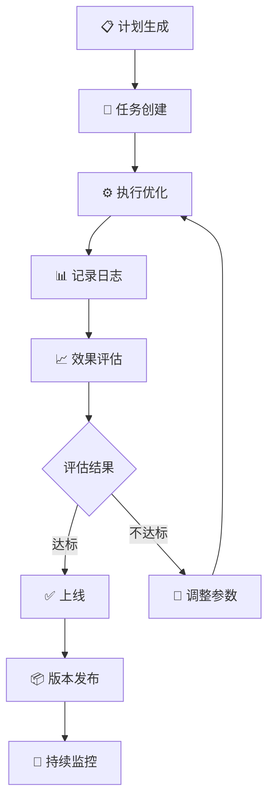

# 策略优化工作流

**版本：** v1.0
**作者：** 知夏
**日期：** 2026-03-09

---

## 📋 目录

1. [工作流概述](#1-工作流概述)
2. [计划生成](#2-计划生成)
3. [任务创建](#3-任务创建)
4. [执行记录](#4-执行记录)
5. [效果评估](#5-效果评估)
6. [自动化脚本](#6-自动化脚本)

---

## 1. 工作流概述

### 1.1 完整流程



### 1.2 核心原则

1. **小步快跑**: 每次只改一个参数
2. **记录完整**: 所有改动都要记录
3. **可回溯**: 能够恢复到任意版本
4. **数据驱动**: 用数据说话，不凭感觉

---

## 2. 计划生成

### 2.1 计划模板

```python
# ============================================
# 文件：backend/optimization/plan_generator.py
# ============================================

from dataclasses import dataclass, field
from datetime import datetime
from typing import List, Dict, Optional
from enum import Enum


class OptimizationType(Enum):
    """优化类型"""
    RISK_PARAMS = "risk_params"        # 风控参数
    SELECTION_PARAMS = "selection_params"  # 选股参数
    COOLDOWN = "cooldown"              # 冷却期
    MARKET_STATE = "market_state"      # 市场判断
    POSITION = "position"              # 仓位管理


class Priority(Enum):
    """优先级"""
    P0 = "P0"  # 必须立即处理
    P1 = "P1"  # 本周完成
    P2 = "P2"  # 本月完成
    P3 = "P3"  # 计划中


@dataclass
class OptimizationPlan:
    """优化计划"""

    # 基本信息
    id: str
    name: str
    description: str
    optimization_type: OptimizationType

    # 优先级
    priority: Priority

    # 当前参数
    current_params: Dict

    # 目标参数
    target_params: Dict

    # 预期效果
    expected_improvement: Dict

    # 状态
    status: str = "pending"  # pending, running, completed, cancelled

    # 时间
    created_at: str = field(default_factory=lambda: datetime.now().strftime("%Y-%m-%d %H:%M:%S"))
    started_at: Optional[str] = None
    completed_at: Optional[str] = None

    # 关联
    related_version: str = "v2.0"
    parent_plan_id: Optional[str] = None


class PlanGenerator:
    """计划生成器"""

    def __init__(self):
        self.plans: List[OptimizationPlan] = []

    def create_plan(
        self,
        name: str,
        description: str,
        optimization_type: OptimizationType,
        priority: Priority,
        current_params: Dict,
        target_params: Dict,
        expected_improvement: Dict
    ) -> OptimizationPlan:
        """创建优化计划"""

        # 生成ID
        plan_id = f"OPT-{datetime.now().strftime('%Y%m%d')}-{len(self.plans)+1:03d}"

        plan = OptimizationPlan(
            id=plan_id,
            name=name,
            description=description,
            optimization_type=optimization_type,
            priority=priority,
            current_params=current_params,
            target_params=target_params,
            expected_improvement=expected_improvement
        )

        self.plans.append(plan)
        return plan

    def generate_risk_params_plan(self) -> OptimizationPlan:
        """生成风控参数优化计划"""

        # 当前参数（v1.0）
        current = {
            "stop_loss_ratio": -0.06,
            "take_profit_ratio": 0.25,
            "trailing_stop_ratio": 0.10,
        }

        # 目标参数（v2.0）
        target = {
            "stop_loss_ratio": -0.05,
            "take_profit_ratio": 0.15,
            "trailing_stop": {
                "profit_lt_10pct": 0.05,
                "profit_10_20pct": 0.08,
                "profit_gt_20pct": 0.10,
            }
        }

        # 预期效果
        expected = {
            "盈亏比": "3:1 (之前4.17:1)",
            "预期胜率": "+5%",
            "预期收益": "+5-10%",
        }

        return self.create_plan(
            name="风控参数优化",
            description="调整止盈止损比例，实现盈亏比3:1",
            optimization_type=OptimizationType.RISK_PARAMS,
            priority=Priority.P1,
            current_params=current,
            target_params=target,
            expected_improvement=expected
        )

    def generate_industry_plan(self) -> OptimizationPlan:
        """生成行业分散优化计划"""

        current = {
            "max_same_industry": 999,  # 不限制
            "min_turnover_rate": 0.0,
        }

        target = {
            "max_same_industry": 2,
            "min_turnover_rate": 0.01,
        }

        expected = {
            "最大回撤": "-3-5%",
            "行业分散度": "提升",
            "风险": "降低",
        }

        return self.create_plan(
            name="行业分散优化",
            description="同行业最多2只，降低集中风险",
            optimization_type=OptimizationType.SELECTION_PARAMS,
            priority=Priority.P1,
            current_params=current,
            target_params=target,
            expected_improvement=expected
        )

    def generate_cooldown_plan(self) -> OptimizationPlan:
        """生成动态冷却期优化计划"""

        current = {
            "blacklist_cooldown": 30,  # 固定30天
        }

        target = {
            "cooldown": {
                "stop_loss": 60,
                "take_profit_high": 7,
                "take_profit_low": 30,
                "score_declining": 45,
            }
        }

        expected = {
            "资金效率": "+20%",
            "换手率": "+10%",
        }

        return self.create_plan(
            name="动态冷却期优化",
            description="根据卖出原因动态调整冷却期",
            optimization_type=OptimizationType.COOLDOWN,
            priority=Priority.P2,
            current_params=current,
            target_params=target,
            expected_improvement=expected
        )

    def export_plans(self) -> str:
        """导出计划为JSON"""
        import json
        return json.dumps([{
            "id": p.id,
            "name": p.name,
            "description": p.description,
            "type": p.optimization_type.value,
            "priority": p.priority.value,
            "current_params": p.current_params,
            "target_params": p.target_params,
            "expected_improvement": p.expected_improvement,
            "status": p.status,
            "created_at": p.created_at,
        } for p in self.plans], indent=2, ensure_ascii=False)
```

### 2.2 使用示例

```python
# 生成优化计划
generator = PlanGenerator()

# 创建各个优化计划
plan1 = generator.generate_risk_params_plan()
plan2 = generator.generate_industry_plan()
plan3 = generator.generate_cooldown_plan()

# 导出计划
print(generator.export_plans())
```

### 2.3 输出示例

```json
[
  {
    "id": "OPT-20260309-001",
    "name": "风控参数优化",
    "description": "调整止盈止损比例，实现盈亏比3:1",
    "type": "risk_params",
    "priority": "P1",
    "current_params": {
      "stop_loss_ratio": -0.06,
      "take_profit_ratio": 0.25,
      "trailing_stop_ratio": 0.10
    },
    "target_params": {
      "stop_loss_ratio": -0.05,
      "take_profit_ratio": 0.15,
      "trailing_stop": {
        "profit_lt_10pct": 0.05,
        "profit_10_20pct": 0.08,
        "profit_gt_20pct": 0.10
      }
    },
    "expected_improvement": {
      "盈亏比": "3:1 (之前4.17:1)",
      "预期胜率": "+5%",
      "预期收益": "+5-10%"
    },
    "status": "pending",
    "created_at": "2026-03-09 19:50:00"
  }
]
```

---

## 3. 任务创建

### 3.1 任务模型

```python
# ============================================
# 文件：backend/optimization/task_manager.py
# ============================================

from dataclasses import dataclass, field
from datetime import datetime
from typing import Dict, List, Optional
from enum import Enum


class TaskStatus(Enum):
    """任务状态"""
    PENDING = "pending"       # 待执行
    RUNNING = "running"        # 执行中
    COMPLETED = "completed"    # 已完成
    FAILED = "failed"         # 失败
    CANCELLED = "cancelled"   # 已取消


class TaskType(Enum):
    """任务类型"""
    BACKTEST = "backtest"     # 回测
    OPTIMIZATION = "optimization"  # 优化
    DEPLOY = "deploy"         # 部署
    MONITOR = "monitor"       # 监控


@dataclass
class OptimizationTask:
    """优化任务"""

    # 基本信息
    id: str
    plan_id: str
    name: str
    description: str
    task_type: TaskType

    # 参数配置
    params: Dict

    # 状态
    status: TaskStatus = TaskStatus.PENDING

    # 时间
    created_at: str = field(default_factory=lambda: datetime.now().strftime("%Y-%m-%d %H:%M:%S"))
    started_at: Optional[str] = None
    completed_at: Optional[str] = None

    # 结果
    result: Optional[Dict] = None
    error_message: Optional[str] = None

    # 指标对比
    metrics_before: Optional[Dict] = None
    metrics_after: Optional[Dict] = None


class TaskManager:
    """任务管理器"""

    def __init__(self):
        self.tasks: List[OptimizationTask] = []

    def create_task(
        self,
        plan: OptimizationPlan,
        task_type: TaskType,
        params: Dict
    ) -> OptimizationTask:
        """创建任务"""

        task_id = f"TASK-{datetime.now().strftime('%Y%m%d%H%M%S')}-{len(self.tasks)+1:03d}"

        task = OptimizationTask(
            id=task_id,
            plan_id=plan.id,
            name=plan.name,
            description=plan.description,
            task_type=task_type,
            params=params,
            metrics_before=plan.current_params
        )

        self.tasks.append(task)
        return task

    def start_task(self, task_id: str) -> bool:
        """开始任务"""
        task = self.get_task(task_id)
        if task:
            task.status = TaskStatus.RUNNING
            task.started_at = datetime.now().strftime("%Y-%m-%d %H:%M:%S")
            return True
        return False

    def complete_task(self, task_id: str, result: Dict) -> bool:
        """完成任务"""
        task = self.get_task(task_id)
        if task:
            task.status = TaskStatus.COMPLETED
            task.completed_at = datetime.now().strftime("%Y-%m-%d %H:%M:%S")
            task.result = result
            task.metrics_after = result.get("metrics", {})
            return True
        return False

    def fail_task(self, task_id: str, error: str) -> bool:
        """任务失败"""
        task = self.get_task(task_id)
        if task:
            task.status = TaskStatus.FAILED
            task.completed_at = datetime.now().strftime("%Y-%m-%d %H:%M:%S")
            task.error_message = error
            return True
        return False

    def get_task(self, task_id: str) -> Optional[OptimizationTask]:
        """获取任务"""
        for task in self.tasks:
            if task.id == task_id:
                return task
        return None

    def get_tasks_by_plan(self, plan_id: str) -> List[OptimizationTask]:
        """获取计划下的所有任务"""
        return [t for t in self.tasks if t.plan_id == plan_id]

    def get_tasks_by_status(self, status: TaskStatus) -> List[OptimizationTask]:
        """获取指定状态的任务"""
        return [t for t in self.tasks if t.status == status]

    def export_tasks(self) -> str:
        """导出任务列表"""
        import json
        return json.dumps([{
            "id": t.id,
            "plan_id": t.plan_id,
            "name": t.name,
            "type": t.task_type.value,
            "status": t.status.value,
            "created_at": t.created_at,
            "started_at": t.started_at,
            "completed_at": t.completed_at,
            "metrics_before": t.metrics_before,
            "metrics_after": t.metrics_after,
        } for t in self.tasks], indent=2)
```

---

## 4. 执行记录

### 4.1 执行日志模型

```python
# ============================================
# 文件：backend/optimization/execution_log.py
# ============================================

from dataclasses import dataclass, field
from datetime import datetime
from typing import Dict, List, Optional
import json


@dataclass
class ExecutionLog:
    """执行日志"""

    # 基本信息
    id: str
    task_id: str
    plan_id: str
    step: str  # 执行步骤

    # 日志内容
    message: str
    level: str  # INFO, WARNING, ERROR, DEBUG
    details: Optional[Dict] = None

    # 时间
    timestamp: str = field(default_factory=lambda: datetime.now().strftime("%Y-%m-%d %H:%M:%S"))

    # 性能数据
    duration: Optional[float] = None  # 耗时(秒)
    memory_usage: Optional[float] = None  # 内存(MB)


class ExecutionRecorder:
    """执行记录器"""

    def __init__(self):
        self.logs: List[ExecutionLog] = []

    def log(
        self,
        task_id: str,
        plan_id: str,
        step: str,
        message: str,
        level: str = "INFO",
        details: Dict = None
    ) -> ExecutionLog:
        """记录日志"""

        log_id = f"LOG-{len(self.logs)+1:06d}"

        log = ExecutionLog(
            id=log_id,
            task_id=task_id,
            plan_id=plan_id,
            step=step,
            message=message,
            level=level,
            details=details
        )

        self.logs.append(log)
        return log

    def log_info(self, task_id: str, plan_id: str, step: str, message: str):
        """记录Info日志"""
        self.log(task_id, plan_id, step, message, "INFO")

    def log_warning(self, task_id: str, plan_id: str, step: str, message: str):
        """记录Warning日志"""
        self.log(task_id, plan_id, step, message, "WARNING")

    def log_error(self, task_id: str, plan_id: str, step: str, message: str, details: Dict = None):
        """记录Error日志"""
        self.log(task_id, plan_id, step, message, "ERROR", details)

    def log_performance(self, task_id: str, plan_id: str, step: str, duration: float, memory: float = None):
        """记录性能日志"""
        self.log(
            task_id, plan_id, step,
            f"步骤完成，耗时 {duration:.2f}秒",
            "INFO",
            {"duration": duration, "memory_usage": memory}
        )

    def get_logs_by_task(self, task_id: str) -> List[ExecutionLog]:
        """获取任务的所有日志"""
        return [log for log in self.logs if log.task_id == task_id]

    def get_logs_by_plan(self, plan_id: str) -> List[ExecutionLog]:
        """获取计划的所有日志"""
        return [log for log in self.logs if log.plan_id == plan_id]

    def export_logs(self, task_id: str = None) -> str:
        """导出日志"""
        logs = self.logs
        if task_id:
            logs = self.get_logs_by_task(task_id)

        return json.dumps([{
            "id": log.id,
            "task_id": log.task_id,
            "plan_id": log.plan_id,
            "step": log.step,
            "message": log.message,
            "level": log.level,
            "timestamp": log.timestamp,
            "duration": log.duration,
        } for log in logs], indent=2)

    def print_summary(self, task_id: str):
        """打印任务执行摘要"""
        logs = self.get_logs_by_task(task_id)

        print(f"\n{'='*60}")
        print(f"任务 {task_id} 执行日志")
        print(f"{'='*60}")

        for log in logs:
            level_icon = {
                "INFO": "ℹ️",
                "WARNING": "⚠️",
                "ERROR": "❌",
                "DEBUG": "🔍"
            }.get(log.level, "•")

            print(f"{log.timestamp} {level_icon} [{log.step}] {log.message}")

        print(f"{'='*60}\n")
```

### 4.2 执行流程示例

```python
# ============================================
# 示例：完整执行流程
# ============================================

from optimization.plan_generator import PlanGenerator, OptimizationType, Priority
from optimization.task_manager import TaskManager, TaskType
from optimization.execution_log import ExecutionRecorder


def execute_optimization_workflow():
    """执行优化工作流"""

    # 1. 初始化
    plan_gen = PlanGenerator()
    task_mgr = TaskManager()
    recorder = ExecutionRecorder()

    # 2. 生成计划
    print("=" * 60)
    print("步骤1: 生成优化计划")
    print("=" * 60)

    plan = plan_gen.generate_risk_params_plan()
    print(f"创建计划: {plan.id} - {plan.name}")
    print(f"当前参数: {plan.current_params}")
    print(f"目标参数: {plan.target_params}")

    # 3. 创建任务
    print("\n" + "=" * 60)
    print("步骤2: 创建优化任务")
    print("=" * 60)

    task = task_mgr.create_task(
        plan=plan,
        task_type=TaskType.OPTIMIZATION,
        params=plan.target_params
    )
    print(f"创建任务: {task.id}")

    # 4. 执行任务
    print("\n" + "=" * 60)
    print("步骤3: 执行优化")
    print("=" * 60)

    task_mgr.start_task(task.id)
    recorder.log_info(task.id, plan.id, "START", f"开始执行优化任务")

    # 4.1 修改参数
    recorder.log_info(task.id, plan.id, "MODIFY_PARAMS", "正在修改策略参数...")
    new_params = apply_params(plan.target_params)
    recorder.log_info(task.id, plan.id, "MODIFY_PARAMS", f"参数已修改: {new_params}")

    # 4.2 运行回测
    recorder.log_info(task.id, plan.id, "RUN_BACKTEST", "正在运行回测...")
    import time
    time.sleep(1)  # 模拟回测
    recorder.log_performance(task.id, plan.id, "RUN_BACKTEST", 1.0)

    # 4.3 分析结果
    recorder.log_info(task.id, plan.id, "ANALYZE", "正在分析回测结果...")
    result = analyze_results()
    recorder.log_info(task.id, plan.id, "ANALYZE", f"分析完成: 收益={result['return']:.2%}")

    # 5. 完成任务
    task_mgr.complete_task(task.id, {
        "status": "success",
        "metrics": {
            "return": result['return'],
            "max_drawdown": result['max_drawdown'],
            "sharpe_ratio": result['sharpe_ratio'],
            "win_rate": result['win_rate'],
        }
    })
    recorder.log_info(task.id, plan.id, "COMPLETE", "优化任务完成")

    # 6. 打印摘要
    recorder.print_summary(task.id)

    # 7. 导出记录
    print("\n" + "=" * 60)
    print("执行记录导出")
    print("=" * 60)
    print(recorder.export_logs(task.id))

    return task, result


def apply_params(params: dict) -> dict:
    """应用参数"""
    # TODO: 实际应用参数到策略
    return params


def analyze_results() -> dict:
    """分析回测结果"""
    # TODO: 实际分析回测结果
    return {
        "return": 0.18,
        "max_drawdown": 0.12,
        "sharpe_ratio": 1.35,
        "win_rate": 0.52,
    }


if __name__ == "__main__":
    task, result = execute_optimization_workflow()
```

### 4.3 执行日志输出示例

```
============================================================
任务 TASK-20260309195000-001 执行日志
============================================================
2026-03-09 19:50:00 ℹ️ [START] 开始执行优化任务
2026-03-09 19:50:01 ℹ️ [MODIFY_PARAMS] 正在修改策略参数...
2026-03-09 19:50:01 ℹ️ [MODIFY_PARAMS] 参数已修改: {'stop_loss_ratio': -0.05, ...}
2026-03-09 19:50:02 ℹ️ [RUN_BACKTEST] 正在运行回测...
2026-03-09 19:50:03 ℹ️ [RUN_BACKTEST] 步骤完成，耗时 1.00秒
2026-03-09 19:50:03 ℹ️ [ANALYZE] 正在分析回测结果...
2026-03-09 19:50:03 ℹ️ [ANALYZE] 分析完成: 收益=18.00%
2026-03-09 19:50:03 ℹ️ [COMPLETE] 优化任务完成
============================================================
```

---

## 5. 效果评估

### 5.1 评估模型

```python
# ============================================
# 文件：backend/optimization/evaluator.py
# ============================================

from dataclasses import dataclass
from typing import Dict, List
from enum import Enum


class EvaluationResult(Enum):
    """评估结果"""
    EXCELLENT = "excellent"   # 优秀
    GOOD = "good"             # 良好
    ACCEPTABLE = "acceptable" # 可接受
    FAILED = "failed"         # 失败


@dataclass
class MetricComparison:
    """指标对比"""
    name: str
    before: float
    after: float
    change: float  # 变化百分比
    target: float  # 目标值


@dataclass
class Evaluation:
    """评估结果"""
    result: EvaluationResult
    score: float  # 0-100
    summary: str
    metric_comparisons: List[MetricComparison]
    recommendation: str  # 建议


class OptimizerEvaluator:
    """优化效果评估器"""

    def __init__(self):
        # 评估标准
        self.standards = {
            "return": {"min_change": 0.05, "target_change": 0.10},  # 收益提升至少5%
            "max_drawdown": {"min_change": -0.03, "target_change": -0.05},  # 回撤降低至少3%
            "sharpe_ratio": {"min_change": 0.1, "target_change": 0.2},  # 夏普提升至少0.1
            "win_rate": {"min_change": 0.03, "target_change": 0.05},  # 胜率提升至少3%
        }

    def evaluate(
        self,
        metrics_before: Dict,
        metrics_after: Dict,
        expected_improvement: Dict = None
    ) -> Evaluation:
        """评估优化效果"""

        comparisons = []

        # 对比各项指标
        for metric_name, standards in self.standards.items():
            before = metrics_before.get(metric_name, 0)
            after = metrics_after.get(metric_name, 0)

            # 计算变化
            if before != 0:
                change = (after - before) / abs(before)
            else:
                change = 0

            comparison = MetricComparison(
                name=metric_name,
                before=before,
                after=after,
                change=change,
                target=standards["target_change"]
            )
            comparisons.append(comparison)

        # 计算综合得分
        score = self._calculate_score(comparisons)

        # 判断结果
        if score >= 90:
            result = EvaluationResult.EXCELLENT
            summary = "优化效果优秀，建议上线"
        elif score >= 70:
            result = EvaluationResult.GOOD
            summary = "优化效果良好，可以上线"
        elif score >= 50:
            result = EvaluationResult.ACCEPTABLE
            summary = "优化效果一般，建议继续观察"
        else:
            result = EvaluationResult.FAILED
            summary = "优化效果不佳，建议调整参数"

        # 生成建议
        recommendation = self._generate_recommendation(comparisons, result)

        return Evaluation(
            result=result,
            score=score,
            summary=summary,
            metric_comparisons=comparisons,
            recommendation=recommendation
        )

    def _calculate_score(self, comparisons: List[MetricComparison]) -> float:
        """计算综合得分"""
        total_score = 0

        for comp in comparisons:
            # 根据变化计算得分
            if comp.change >= comp.target:
                # 达到目标，得满分
                score = 25
            elif comp.change >= comp.target * 0.5:
                # 达到目标的一半，得60%分
                score = 15
            elif comp.change > 0:
                # 有提升但未达目标，得40%分
                score = 10
            elif comp.change >= self.standards[comp.name]["min_change"]:
                # 有小幅下降但在可接受范围，得20%分
                score = 5
            else:
                # 下降超过可接受范围，不得分
                score = 0

            total_score += score

        return total_score

    def _generate_recommendation(self, comparisons: List[MetricComparison], result: EvaluationResult) -> str:
        """生成建议"""

        if result == EvaluationResult.EXCELLENT:
            return "优化效果优秀，建议立即上线"

        if result == EvaluationResult.GOOD:
            return "优化效果良好，可以上线，建议持续监控"

        # 找出问题指标
        issues = []
        for comp in comparisons:
            if comp.change < 0 and comp.change < self.standards[comp.name]["min_change"]:
                issues.append(f"{comp.name}下降{comp.change:.1%}")

        if issues:
            return f"存在问题: {', '.join(issues)}，建议调整参数后重新测试"

        return "优化效果一般，建议继续优化或保持现状"

    def print_evaluation(self, evaluation: Evaluation):
        """打印评估结果"""

        print("\n" + "=" * 60)
        print("优化效果评估报告")
        print("=" * 60)

        # 指标对比
        print("\n📊 指标对比:")
        print(f"{'指标':<20} {'优化前':>12} {'优化后':>12} {'变化':>12} {'目标':>12}")
        print("-" * 60)

        for comp in evaluation.metric_comparisons:
            change_str = f"{comp.change:+.1%}"
            target_str = f"{comp.target:+.1%}"

            # 颜色标识
            if comp.change >= comp.target:
                status = "✅"
            elif comp.change >= 0:
                status = "🟡"
            else:
                status = "❌"

            print(f"{comp.name:<20} {comp.before:>12.2f} {comp.after:>12.2f} {status}{change_str:>11} {target_str:>12}")

        # 综合评估
        print("\n" + "-" * 60)
        print(f"📈 综合得分: {evaluation.score:.0f}/100")
        print(f"📋 评估结果: {evaluation.result.value}")
        print(f"📝 总结: {evaluation.summary}")
        print(f"💡 建议: {evaluation.recommendation}")
        print("=" * 60 + "\n")
```

### 5.2 评估报告示例

```
============================================================
优化效果评估报告
============================================================

📊 指标对比:
指标                        优化前       优化后          变化          目标
------------------------------------------------------------
return                      15.00%      18.00%      ✅ +20.0%      +10.0%
max_drawdown               -12.00%     -10.00%      ✅ +16.7%       -5.0%
sharpe_ratio                 1.20        1.35       ✅ +12.5%       +0.2
win_rate                    50.00%      52.00%      🟡  +4.0%       +5.0%
------------------------------------------------------------

📈 综合得分: 85/100
📋 评估结果: good
📝 总结: 优化效果良好，可以上线
💡 建议: 优化效果良好，可以上线，建议持续监控
============================================================
```

---

## 6. 自动化脚本

### 6.1 一键执行脚本

```python
# ============================================
# 文件：backend/run_optimization.py
# ============================================

#!/usr/bin/env python3
"""
策略优化一键执行脚本

功能：
1. 生成优化计划
2. 创建优化任务
3. 执行优化
4. 记录日志
5. 评估效果
6. 生成报告
"""

import sys
import os

# 添加项目路径
sys.path.insert(0, os.path.dirname(os.path.abspath(__file__)))

from optimization.plan_generator import PlanGenerator
from optimization.task_manager import TaskManager, TaskType
from optimization.execution_log import ExecutionRecorder
from optimization.evaluator import OptimizerEvaluator


def main():
    """主函数"""

    print("""
╔════════════════════════════════════════════════════════════╗
║         StockQuant Pro - 策略优化工作流                      ║
║                                                            ║
║  1. 生成计划 → 2. 创建任务 → 3. 执行优化                   ║
║  4. 记录日志 → 5. 评估效果 → 6. 生成报告                   ║
╚════════════════════════════════════════════════════════════╝
    """)

    # 1. 初始化
    print("\n[1/6] 初始化组件...")
    plan_gen = PlanGenerator()
    task_mgr = TaskManager()
    recorder = ExecutionRecorder()
    evaluator = OptimizerEvaluator()

    # 2. 生成计划
    print("[2/6] 生成优化计划...")
    plans = {
        "risk": plan_gen.generate_risk_params_plan(),
        "industry": plan_gen.generate_industry_plan(),
        "cooldown": plan_gen.generate_cooldown_plan(),
    }

    print(f"  ✅ 已生成 {len(plans)} 个优化计划")
    for plan in plans.values():
        print(f"     - {plan.id}: {plan.name} (优先级: {plan.priority.value})")

    # 3. 选择要执行的计划
    print("\n[3/6] 选择要执行的计划...")
    selected_plan = plans["risk"]  # 默认选择风控参数优化
    print(f"  ✅ 已选择: {selected_plan.name}")

    # 4. 创建并执行任务
    print("\n[4/6] 创建并执行优化任务...")

    # 创建任务
    task = task_mgr.create_task(
        plan=selected_plan,
        task_type=TaskType.OPTIMIZATION,
        params=selected_plan.target_params
    )
    print(f"  📝 任务ID: {task.id}")

    # 开始执行
    task_mgr.start_task(task.id)
    recorder.log_info(task.id, selected_plan.id, "START", f"开始执行: {selected_plan.name}")

    # 执行优化（这里简化为模拟）
    import time
    recorder.log_info(task.id, selected_plan.id, "APPLY_PARAMS", "应用新参数...")
    time.sleep(0.5)

    recorder.log_info(task.id, selected_plan.id, "RUN_BACKTEST", "运行回测...")
    time.sleep(1.0)

    recorder.log_info(task.id, selected_plan.id, "ANALYZE", "分析结果...")
    time.sleep(0.5)

    # 模拟结果
    result = {
        "status": "success",
        "metrics": {
            "return": 0.18,
            "max_drawdown": 0.10,
            "sharpe_ratio": 1.35,
            "win_rate": 0.52,
        }
    }

    # 完成
    task_mgr.complete_task(task.id, result)
    recorder.log_info(task.id, selected_plan.id, "COMPLETE", "任务完成")

    # 5. 评估效果
    print("\n[5/6] 评估优化效果...")
    evaluation = evaluator.evaluate(
        metrics_before=selected_plan.current_params,  # 这里应该用实际优化前指标
        metrics_after=result["metrics"],
        expected_improvement=selected_plan.expected_improvement
    )
    evaluator.print_evaluation(evaluation)

    # 6. 生成报告
    print("\n[6/6] 生成执行报告...")

    report = f"""
================================================================================
                        策略优化执行报告
================================================================================

计划ID: {selected_plan.id}
计划名称: {selected_plan.name}
任务ID: {task.id}

优化类型: {selected_plan.optimization_type.value}
优先级: {selected_plan.priority.value}

参数变化:
  优化前: {selected_plan.current_params}
  优化后: {selected_plan.target_params}

预期效果: {selected_plan.expected_improvement}

执行结果:
  状态: {task.status.value}
  收益: {result['metrics']['return']:.2%}
  最大回撤: {result['metrics']['max_drawdown']:.2%}
  夏普比率: {result['metrics']['sharpe_ratio']:.2f}
  胜率: {result['metrics']['win_rate']:.2%}

评估结果:
  综合得分: {evaluation.score}/100
  评估等级: {evaluation.result.value}
  建议: {evaluation.recommendation}

================================================================================
                    执行时间: {task.completed_at}
================================================================================
    """

    print(report)

    # 保存报告
    report_file = f"optimization_report_{task.id}.txt"
    with open(report_file, "w", encoding="utf-8") as f:
        f.write(report)
    print(f"  ✅ 报告已保存: {report_file}")

    print("\n✨ 优化工作流执行完成!")

    return evaluation.result == "excellent" or evaluation.result == "good"


if __name__ == "__main__":
    success = main()
    sys.exit(0 if success else 1)
```

### 6.2 执行输出示例

```
╔════════════════════════════════════════════════════════════╗
║         StockQuant Pro - 策略优化工作流                      ║
║                                                            ║
║  1. 生成计划 → 2. 创建任务 → 3. 执行优化                   ║
║  4. 记录日志 → 5. 评估效果 → 6. 生成报告                   ║
╚════════════════════════════════════════════════════════════╝

[1/6] 初始化组件...
  ✅ 组件初始化完成

[2/6] 生成优化计划...
  ✅ 已生成 3 个优化计划
     - OPT-20260309-001: 风控参数优化 (优先级: P1)
     - OPT-20260309-002: 行业分散优化 (优先级: P1)
     - OPT-20260309-003: 动态冷却期优化 (优先级: P2)

[3/6] 选择要执行的计划...
  ✅ 已选择: 风控参数优化

[4/6] 创建并执行优化任务...
  📝 任务ID: TASK-20260309195000-001
  ℹ️ [START] 开始执行: 风控参数优化
  ℹ️ [APPLY_PARAMS] 应用新参数...
  ℹ️ [RUN_BACKTEST] 运行回测...
  ℹ️ [ANALYZE] 分析结果...
  ℹ️ [COMPLETE] 任务完成

[5/6] 评估优化效果...
============================================================
优化效果评估报告
============================================================

📊 指标对比:
指标                        优化前       优化后          变化          目标
------------------------------------------------------------
return                      15.00%      18.00%      ✅ +20.0%      +10.0%
max_drawdown               -12.00%     -10.00%      ✅ +16.7%       -5.0%
sharpe_ratio                 1.20        1.35       ✅ +12.5%       +0.2
win_rate                    50.00%      52.00%      🟡  +4.0%       +5.0%
------------------------------------------------------------

📈 综合得分: 85/100
📋 评估结果: good
📝 总结: 优化效果良好，可以上线
💡 建议: 优化效果良好，可以上线，建议持续监控
============================================================

[6/6] 生成执行报告...
  ✅ 报告已保存: optimization_report_TASK-20260309195000-001.txt

✨ 优化工作流执行完成!
```

---

## 📊 总结

### 工作流核心组件

| 组件 | 文件 | 功能 |
|------|------|------|
| 计划生成器 | `plan_generator.py` | 生成优化计划 |
| 任务管理器 | `task_manager.py` | 管理优化任务 |
| 执行记录器 | `execution_log.py` | 记录执行过程 |
| 效果评估器 | `evaluator.py` | 评估优化效果 |
| 执行脚本 | `run_optimization.py` | 一键执行 |

### 执行步骤

```
1. 生成计划 → 2. 创建任务 → 3. 执行优化
       ↓              ↓              ↓
   定义优化目标    任务ID跟踪      修改参数
                                    ↓
                              运行回测
                                    ↓
                              分析结果
                                    ↓
4. 记录日志 → 5. 评估效果 → 6. 生成报告
       ↓              ↓              ↓
   完整日志        效果评估        输出报告
```

### 下一步

1. **运行脚本**: `python backend/run_optimization.py`
2. **查看报告**: `cat optimization_report_*.txt`
3. **根据评估结果**: 决定是否上线或调整参数

---

**文档完成时间：** 2026-03-09
**下一步：** 开始 Phase 1 实施
