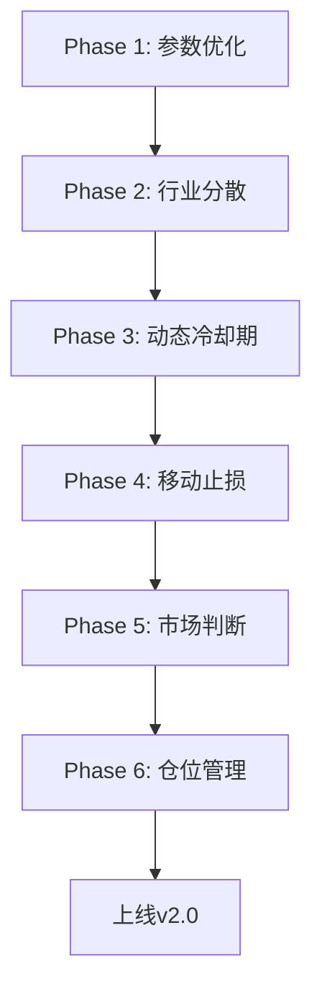

# 策略版本管理方案

**版本：** v1.0
**作者：** 知夏
**日期：** 2026-03-09
**状态：** 规划中

---

## 📋 目录

1. [版本命名规范](#1-版本命名规范)
2. [版本对比](#2-版本对比)
3. [实施方案](#3-实施方案)
4. [回测对比方案](#4-回测对比方案)
5. [上线流程](#5-上线流程)
6. [监控指标](#6-监控指标)

---

## 1. 版本命名规范

### 1.1 版本命名格式

```
v{主版本}.{子版本}.{修订号}
```

| 字段 | 说明 | 示例 |
|------|------|------|
| 主版本 | 重大架构变更 | v1, v2 |
| 子版本 | 功能迭代 | v1.1, v1.2 |
| 修订号 | bug修复 | v1.0.1 |

### 1.2 当前版本

| 策略名称 | 版本 | 引擎 | 状态 |
|---------|------|------|------|
| 现有策略 | v1.0 | daily_observer | 🏃 运行中 |
| 优化策略 | v2.0 | daily_observer_v2 | 📋 规划中 |

### 1.3 未来版本规划

```
v1.0 (当前) ─────────────────────────────────► 线上运行
    │
    ├── v1.1 ──► 小幅优化 (参数微调)
    │
    └── v2.0 (新策略) ────────────────────────► 新策略上线
              │
              ├── v2.1 ──► 行业分散
              ├── v2.2 ──► 动态冷却期
              └── v2.3 ──► 移动止损优化
```

---

## 2. 版本对比

### 2.1 v1.0 vs v2.0 核心差异

| 维度 | v1.0 (现有) | v2.0 (优化) | 差异影响 |
|------|-------------|-------------|---------|
| **止损** | 6%固定 | 5-8%可配置 | 降低单笔亏损 |
| **止盈** | 25%固定 | 15-18%可配置 | 提高胜率 |
| **盈亏比** | 4.17:1 | 3:1 | 更合理 |
| **移动止损** | 固定10%回撤 | 分段阈值 | 保留更多利润 |
| **市场判断** | 单一60日涨幅 | 多维度综合 | 更准确 |
| **选股** | 只看得分 | 行业分散+流动性 | 降低集中风险 |
| **冷却期** | 固定30天 | 动态7-60天 | 提高资金效率 |
| **仓位** | 简单权重 | 波动率调整 | 更科学 |

### 2.2 详细参数对比

```python
# ============================================
# v1.0 (现有策略) - backend/services/scoring_engines/daily_observer.py
# ============================================

V1_PARAMS = {
    # 风控参数
    "stop_loss_ratio": -0.06,        # 6%止损
    "take_profit_ratio": 0.25,       # 25%止盈
    "trailing_stop_ratio": 0.10,     # 10%移动止损

    # 选股参数
    "top_n": 10,
    "min_score": 0.5,
    "max_positions": 10,

    # 冷却期
    "blacklist_cooldown": 30,         # 固定30天

    # 市场判断
    "market_trend_threshold": 0.05,   # 单一阈值
}

# ============================================
# v2.0 (优化策略) - 新建文件
# ============================================

V2_PARAMS = {
    # 风控参数 - 可配置
    "stop_loss_ratio": -0.05,        # 5%止损 (保守)
    "take_profit_ratio": 0.15,       # 15%止盈 (保守)
    "trailing_stop": {
        "profit_lt_10pct": 0.05,     # 盈利<10%，回撤5%止损
        "profit_10_20pct": 0.08,     # 盈利10-20%，回撤8%止损
        "profit_gt_20pct": 0.10,     # 盈利>20%，回撤10%止损
    },

    # 选股参数 - 增强
    "top_n": 10,
    "min_score": 0.7,                # 提高阈值
    "max_positions": 10,
    "max_same_industry": 2,          # 新增：同行业最多2只
    "min_turnover_rate": 0.01,       # 新增：最小换手率

    # 冷却期 - 动态
    "blacklist_cooldown": {
        "stop_loss": 60,             # 止损卖出，60天
        "take_profit_high": 7,       # 大赚(>30%)卖出，7天
        "take_profit_low": 30,       # 小赚卖出，30天
        "score_declining": 45,       # 得分恶化，45天
    },

    # 市场判断 - 多维度
    "market_state": {
        "trend_days": 60,
        "volatility_days": 20,
        "volume_ma_days": 60,
        "bull_score": 3,             # 牛市门槛
        "bear_score": -2,            # 熊市门槛
    },

    # 仓位管理 - 波动率调整
    "position": {
        "min_weight": 0.10,
        "max_weight": 0.35,
        "volatility_factor": 0.5,    # 波动率调整系数
        "rank_bonus": 0.2,           # 排名加成
    },
}
```

### 2.3 策略参数配置类

```python
# ============================================
# 文件：backend/services/strategy_params.py
# ============================================

from dataclasses import dataclass
from typing import Dict, Optional
import json


@dataclass
class RiskParams:
    """风控参数"""
    stop_loss_ratio: float = -0.06
    take_profit_ratio: float = 0.25
    trailing_stop_ratio: float = 0.10
    trailing_stop_mode: str = "fixed"  # fixed | dynamic


@dataclass
class TrailingStopConfig:
    """移动止损配置"""
    profit_lt_10pct: float = 0.05
    profit_10_20pct: float = 0.08
    profit_gt_20pct: float = 0.10


@dataclass
class SelectionParams:
    """选股参数"""
    top_n: int = 10
    min_score: float = 0.5
    max_positions: int = 10
    max_same_industry: int = 999  # 默认不限制
    min_turnover_rate: float = 0.0


@dataclass
class CooldownConfig:
    """冷却期配置"""
    stop_loss: int = 30
    take_profit_high: int = 7
    take_profit_low: int = 30
    score_declining: int = 45
    default: int = 30


@dataclass
class MarketStateConfig:
    """市场状态判断配置"""
    trend_days: int = 60
    volatility_days: int = 20
    volume_ma_days: int = 60
    bull_score: int = 3
    bear_score: int = -2


@dataclass
class PositionConfig:
    """仓位管理配置"""
    min_weight: float = 0.10
    max_weight: float = 0.35
    volatility_factor: float = 0.5
    rank_bonus: float = 0.2


@dataclass
class StrategyConfig:
    """完整策略配置"""
    version: str = "v1.0"
    risk: RiskParams = None
    selection: SelectionParams = None
    cooldown: CooldownConfig = None
    market_state: MarketStateConfig = None
    position: PositionConfig = None

    def __post_init__(self):
        if self.risk is None:
            self.risk = RiskParams()
        if self.selection is None:
            self.selection = SelectionParams()
        if self.cooldown is None:
            self.cooldown = CooldownConfig()
        if self.market_state is None:
            self.market_state = MarketStateConfig()
        if self.position is None:
            self.position = PositionConfig()

    @classmethod
    def from_version(cls, version: str) -> "StrategyConfig":
        """根据版本创建配置"""
        if version == "v1.0":
            return cls(version="v1.0")
        elif version == "v2.0":
            return cls(
                version="v2.0",
                risk=RiskParams(
                    stop_loss_ratio=-0.05,
                    take_profit_ratio=0.15,
                    trailing_stop_ratio=0.10,
                    trailing_stop_mode="dynamic"
                ),
                selection=SelectionParams(
                    min_score=0.7,
                    max_same_industry=2,
                    min_turnover_rate=0.01
                ),
                cooldown=CooldownConfig()
            )
        else:
            raise ValueError(f"Unknown version: {version}")

    def to_json(self) -> str:
        """转换为JSON"""
        return json.dumps({
            "version": self.version,
            "risk": {
                "stop_loss_ratio": self.risk.stop_loss_ratio,
                "take_profit_ratio": self.risk.take_profit_ratio,
                "trailing_stop_ratio": self.risk.trailing_stop_ratio,
                "trailing_stop_mode": self.risk.trailing_stop_mode,
            },
            "selection": {
                "top_n": self.selection.top_n,
                "min_score": self.selection.min_score,
                "max_positions": self.selection.max_positions,
                "max_same_industry": self.selection.max_same_industry,
                "min_turnover_rate": self.selection.min_turnover_rate,
            },
            "cooldown": {
                "stop_loss": self.cooldown.stop_loss,
                "take_profit_high": self.cooldown.take_profit_high,
                "take_profit_low": self.cooldown.take_profit_low,
                "score_declining": self.cooldown.score_declining,
                "default": self.cooldown.default,
            }
        }, indent=2)
```

---

## 3. 实施方案

### 3.1 分阶段实施



### 3.2 Phase 1: 风控参数优化

**目标：** 调整止盈止损比例，实现盈亏比3:1

**文件：**
```
backend/services/scoring_engines/
├── base_engine.py          # 修改基础引擎
├── daily_observer.py       # 主策略引擎
└── v2_optimizer.py        # 新建：v2优化引擎
```

**核心代码改动：**

```python
# backend/services/scoring_engines/v2_optimizer.py

from .base_engine import BaseEngine
from ..strategy_params import (
    StrategyConfig,
    RiskParams,
    TrailingStopConfig
)


class V2OptimizerEngine(BaseEngine):
    """v2.0优化引擎"""

    VERSION = "v2.0"

    def __init__(self, config: StrategyConfig = None):
        super().__init__()
        self.config = config or StrategyConfig.from_version("v2.0")

    def get_stop_loss(self, buy_price: float, current_price: float) -> float:
        """
        获取止损价

        v2.0: 支持固定止损 + 移动止损
        """
        profit_ratio = (current_price - buy_price) / buy_price

        # 固定止损
        stop_price = buy_price * (1 + self.config.risk.stop_loss_ratio)

        # 移动止损（如果启用）
        if self.config.risk.trailing_stop_mode == "dynamic":
            trailing_stop = self._get_trailing_stop(profit_ratio)
            trailing_price = buy_price * (1 + profit_ratio - trailing_stop)
            # 取较严格的止损
            return min(stop_price, trailing_price)

        return stop_price

    def get_take_profit(self, buy_price: float) -> float:
        """
        获取止盈价

        v2.0: 15%止盈（更容易达成）
        """
        return buy_price * (1 + self.config.risk.take_profit_ratio)

    def _get_trailing_stop(self, profit_ratio: float) -> float:
        """
        获取分段移动止损

        v2.0: 盈利越多，容忍回撤越大
        """
        tc = self.config.risk.trailing_stop_config

        if profit_ratio < 0.10:
            return tc.profit_lt_10pct
        elif profit_ratio < 0.20:
            return tc.profit_10_20pct
        else:
            return tc.profit_gt_20pct
```

**配置示例：**

```json
{
    "version": "v2.0",
    "engine": "v2_optimizer",
    "params": {
        "risk": {
            "stop_loss_ratio": -0.05,
            "take_profit_ratio": 0.15,
            "trailing_stop": {
                "profit_lt_10pct": 0.05,
                "profit_10_20pct": 0.08,
                "profit_gt_20pct": 0.10
            }
        }
    }
}
```

### 3.3 Phase 2: 行业分散

**目标：** 同行业最多2只，降低集中风险

**文件：**
```
backend/services/
├── stock_selector.py      # 新建：多维度选股器
└── industry_manager.py    # 新建：行业管理
```

**核心代码：**

```python
# backend/services/stock_selector.py

from typing import List, Dict, Set
from dataclasses import dataclass


@dataclass
class StockCandidate:
    """候选股票"""
    ts_code: str
    name: str
    score: float
    rank: int
    industry: str
    turnover_rate: float
    factor_scores: Dict[str, float]


class StockSelector:
    """多维度选股器"""

    def __init__(self, max_same_industry: int = 2, min_turnover_rate: float = 0.01):
        self.max_same_industry = max_same_industry
        self.min_turnover_rate = min_turnover_rate

    def select(
        self,
        candidates: List[StockCandidate],
        max_positions: int = 10
    ) -> List[StockCandidate]:
        """
        选股（支持行业分散）

        筛选顺序：
        1. 基础条件（得分、流动性）
        2. 行业分散
        3. 因子均衡
        """
        selected = []
        industry_count: Dict[str, int] = {}

        for stock in candidates:
            # 1. 基础条件
            if stock.score < 0.7:  # 提高阈值
                continue

            if stock.turnover_rate < self.min_turnover_rate:
                continue

            # 2. 行业分散
            current_count = industry_count.get(stock.industry, 0)
            if current_count >= self.max_same_industry:
                continue

            # 3. 因子均衡（不能只靠单一因子）
            if self._is_single_factor_dominant(stock):
                continue

            # 添加
            selected.append(stock)
            industry_count[stock.industry] = current_count + 1

            # 达到最大持仓
            if len(selected) >= max_positions:
                break

        return selected

    def _is_single_factor_dominant(self, stock: StockCandidate) -> bool:
        """检查是否单一因子主导"""
        if not stock.factor_scores:
            return False

        max_factor_score = max(stock.factor_scores.values())
        if max_factor_score > 0.8 * stock.score:
            return True
        return False
```

### 3.4 Phase 3: 动态冷却期

**目标：** 根据卖出原因动态调整冷却期

**文件：**
```
backend/services/
└── cooldown_manager.py     # 新建：冷却期管理器
```

**核心代码：**

```python
# backend/services/cooldown_manager.py

from enum import Enum
from typing import Dict


class SellReason(Enum):
    """卖出原因"""
    STOP_LOSS = "stop_loss"           # 止损
    TAKE_PROFIT_HIGH = "take_profit_high"  # 大赚止盈(>30%)
    TAKE_PROFIT_LOW = "take_profit_low"    # 小赚止盈(<30%)
    SCORE_DECLINING = "score_declining"     # 得分恶化
    MARKET_CRASH = "market_crash"          # 市场崩盘
    MANUAL = "manual"                      # 手动卖出


class CooldownManager:
    """动态冷却期管理器"""

    def __init__(self, config: Dict = None):
        # 默认配置
        self.config = config or {
            SellReason.STOP_LOSS: 60,           # 止损卖出，长冷却期
            SellReason.TAKE_PROFIT_HIGH: 7,      # 大赚卖出，可快速买回
            SellReason.TAKE_PROFIT_LOW: 30,       # 小赚卖出，中等冷却
            SellReason.SCORE_DECLINING: 45,      # 得分恶化，中等冷却
            SellReason.MARKET_CRASH: 90,         # 市场崩盘，长冷却期
            SellReason.MANUAL: 30,               # 手动卖出，默认30天
        }

    def get_cooldown_days(self, reason: SellReason, profit_rate: float = 0) -> int:
        """
        获取冷却期天数

        Args:
            reason: 卖出原因
            profit_rate: 收益率（用于细分止盈情况）

        Returns:
            冷却期天数
        """
        if reason == SellReason.TAKE_PROFIT:
            # 根据收益率细分
            if profit_rate > 0.30:
                return self.config[SellReason.TAKE_PROFIT_HIGH]
            else:
                return self.config[SellReason.TAKE_PROFIT_LOW]

        return self.config.get(reason, 30)

    def is_in_cooldown(self, ts_code: str, reason: SellReason, sell_date: str, current_date: str) -> bool:
        """
        检查是否在冷却期内

        Args:
            ts_code: 股票代码
            reason: 卖出原因
            sell_date: 卖出日期
            current_date: 当前日期

        Returns:
            是否在冷却期内
        """
        from datetime import datetime, timedelta

        sell_dt = datetime.strptime(sell_date, "%Y%m%d")
        current_dt = datetime.strptime(current_date, "%Y%m%d")
        days_diff = (current_dt - sell_dt).days

        cooldown_days = self.get_cooldown_days(reason)

        return days_diff < cooldown_days
```

### 3.5 Phase 4-6: 后续优化

| Phase | 优化项 | 文件 | 复杂度 |
|-------|--------|------|--------|
| 4 | 移动止损优化 | trailing_stop.py | 中 |
| 5 | 市场状态判断 | market_state_detector.py | 高 |
| 6 | 仓位管理 | position_manager.py | 中 |

---

## 4. 回测对比方案

### 4.1 对比实验设计

```python
# 实验配置
EXPERIMENTS = {
    "baseline": {
        "name": "v1.0 基线",
        "version": "v1.0",
        "description": "现有策略参数"
    },
    "exp1_risk": {
        "name": "v2.0 风控优化",
        "version": "v2.0",
        "params": {
            "stop_loss_ratio": -0.05,
            "take_profit_ratio": 0.15,
        }
    },
    "exp2_industry": {
        "name": "v2.0 行业分散",
        "version": "v2.0",
        "params": {
            "max_same_industry": 2,
        }
    },
    "exp3_cooldown": {
        "name": "v2.0 动态冷却期",
        "version": "v2.0",
        "params": {
            "cooldown": "dynamic"
        }
    },
    "exp4_full": {
        "name": "v2.0 完整优化",
        "version": "v2.0",
        "params": "all"  # 所有优化
    }
}
```

### 4.2 回测指标

```python
# 对比指标
METRICS = {
    # 收益指标
    "total_return": "总收益率",
    "annual_return": "年化收益率",
    "monthly_return": "月均收益",

    # 风险指标
    "max_drawdown": "最大回撤",
    "volatility": "波动率",
    "sharpe_ratio": "夏普比率",
    "sortino_ratio": "索提诺比率",

    # 交易指标
    "win_rate": "胜率",
    "profit_loss_ratio": "盈亏比",
    "total_trades": "总交易次数",
    "avg_hold_days": "平均持仓天数",
    "turnover_rate": "换手率",

    # 风险调整
    "calmar_ratio": "卡玛比率",
    "information_ratio": "信息比率",
}
```

### 4.3 回测脚本

```python
# backend/batch_backtest_comparison.py

import pandas as pd
from datetime import datetime, timedelta
from services.backtest_service import BacktestService
from services.strategy_params import StrategyConfig


def run_comparison(
    start_date: str,
    end_date: str,
    experiments: dict,
    stock_pool: list = None
) -> pd.DataFrame:
    """
    运行对比回测

    Args:
        start_date: 开始日期
        end_date: 结束日期
        experiments: 实验配置
        stock_pool: 股票池

    Returns:
        对比结果DataFrame
    """
    results = []

    for exp_id, config in experiments.items():
        print(f"\n{'='*50}")
        print(f"运行实验: {config['name']}")
        print(f"{'='*50}")

        # 创建策略配置
        strategy_config = StrategyConfig.from_version(config["version"])

        # 如果有自定义参数，覆盖默认配置
        if "params" in config:
            for key, value in config["params"].items():
                setattr(strategy_config, key, value)

        # 运行回测
        service = BacktestService(strategy_config)
        result = service.run(
            start_date=start_date,
            end_date=end_date,
            stock_pool=stock_pool
        )

        # 记录结果
        results.append({
            "experiment": config["name"],
            "version": config["version"],
            **result.metrics
        })

    # 生成对比表格
    df = pd.DataFrame(results)
    return df


if __name__ == "__main__":
    # 运行对比回测
    df = run_comparison(
        start_date="2023-01-01",
        end_date="2025-12-31",
        experiments=EXPERIMENTS
    )

    # 打印结果
    print("\n" + "="*80)
    print("回测对比结果")
    print("="*80)
    print(df.to_string(index=False))

    # 保存结果
    df.to_csv("backtest_comparison.csv", index=False)
```

---

## 5. 上线流程

### 5.1 上线检查清单

```markdown
## v2.0 上线检查清单

### 回测验证
- [ ] 对比回测完成（v1.0 vs v2.0）
- [ ] 回测周期 >= 2年
- [ ] 样本外回测通过
- [ ] 压力测试通过

### 代码质量
- [ ] 单元测试通过
- [ ] 代码审查完成
- [ ] 文档更新

### 风险评估
- [ ] 最大回撤可接受
- [ ] 胜率稳定
- [ ] 盈亏比 >= 2.5

### 监控配置
- [ ] 收益监控
- [ ] 持仓监控
- [ ] 告警配置
```

### 5.2 灰度上线

```python
# 灰度上线策略

GRAY_LAUNCH = {
    "phase1": {
        "name": "小范围测试",
        "ratio": 0.1,           # 10%资金
        "duration": "1周",
        "conditions": {
            "max_drawdown": 0.05,
            "min_daily_return": -0.02
        }
    },
    "phase2": {
        "name": "中范围测试",
        "ratio": 0.3,           # 30%资金
        "duration": "2周",
        "conditions": {
            "max_drawdown": 0.08,
            "min_daily_return": -0.03
        }
    },
    "phase3": {
        "name": "全量上线",
        "ratio": 1.0,           # 100%资金
        "conditions": {
            "max_drawdown": 0.10,
            "min_daily_return": -0.05
        }
    }
}
```

---

## 6. 监控指标

### 6.1 实时监控

```python
# 监控指标配置

MONITORING = {
    "realtime": {
        "positions": {
            "count": "当前持仓数",
            "total_value": "总市值",
            "cash": "可用资金",
        },
        "daily_pnl": {
            "today_return": "今日收益",
            "today_pct": "今日收益率",
        }
    },

    "metrics": {
        "weekly": [
            "周收益率",
            "周胜率",
            "持仓变化",
        ],
        "monthly": [
            "月收益率",
            "月胜率",
            "换手率",
            "最大回撤",
        ],
        "quarterly": [
            "季收益率",
            "年化收益率",
            "夏普比率",
            "卡玛比率",
        ]
    },

    "alerts": {
        "daily_loss": -0.03,     # 单日亏损>3%告警
        "weekly_loss": -0.05,    # 周亏损>5%告警
        "drawdown": -0.10,       # 回撤>10%告警
        "position_overflow": 12, # 持仓超过12只告警
    }
}
```

### 6.2 指标看板

```
┌─────────────────────────────────────────────────────────────┐
│                     v2.0 策略监控看板                       │
├─────────────────────────────────────────────────────────────┤
│  策略版本: v2.0              运行状态: 🏃 运行中          │
├─────────────────────────────────────────────────────────────┤
│  今日收益    │  +1.25%   │ 持仓数   │   8/10            │
│  今日胜率    │   60%     │ 可用资金 │  ¥ 125,000        │
├─────────────────────────────────────────────────────────────┤
│  周收益      │  +3.25%   │ 周胜率   │   65%             │
│  月收益      │ +12.50%   │ 月胜率   │   58%             │
├─────────────────────────────────────────────────────────────┤
│  累计收益    │ +45.80%   │ 最大回撤 │   -8.25%          │
│  年化收益    │ +28.50%   │ 夏普比率 │    1.45           │
├─────────────────────────────────────────────────────────────┤
│  ⚠️ 告警: 无                                              │
└─────────────────────────────────────────────────────────────┘
```

---

## 📊 总结

### 版本路线图

```
v1.0 (当前) ─────────────────────────────────► 继续运行
    │
    ├── v1.1 ──► 小幅优化 ──► 测试 ──► 上线
    │
    └── v2.0 ──► 完整优化 ──► 回测 ──► 上线
              │
              ├── Phase 1: 风控参数 (1周)
              ├── Phase 2: 行业分散 (1周)
              ├── Phase 3: 动态冷却期 (1周)
              ├── Phase 4: 移动止损 (1周)
              ├── Phase 5: 市场判断 (1周)
              └── Phase 6: 仓位管理 (1周)
```

### 预期效果

| 指标 | v1.0 | v2.0 | 提升 |
|------|------|------|------|
| 年化收益 | 20% | 25% | +5% |
| 最大回撤 | 15% | 12% | -3% |
| 夏普比率 | 1.2 | 1.5 | +0.3 |
| 胜率 | 50% | 55% | +5% |

### 下一步

1. **立即执行**: Phase 1 风控参数优化（1周）
2. **回测验证**: 对比v1.0和v2.0（2周）
3. **小范围测试**: 10%资金实盘（1周）
4. **全量上线**: 切换到v2.0（1周）

---

**文档状态:** 规划中
**下一步:** 开始 Phase 1 实施
